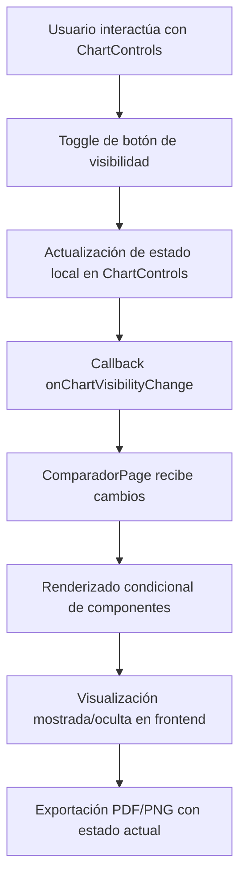

# Sistema de Visibilidad de Visualizaciones

## 📋 Explicación del Funcionamiento

### **1. Flujo de Control de Visibilidad**



### **2. Componentes Involucrados**

#### **ChartControls (src/components/charts/ChartControls.tsx)**
- **Responsabilidad**: Panel de control para mostrar/ocultar visualizaciones
- **Estado**: `localCharts` - Objeto con estado de visibilidad de cada gráfico
- **Eventos**: `toggleChart()` - Alterna visibilidad de gráficos individuales

#### **ComparadorPage (src/pages/ComparadorPage.tsx)**
- **Responsabilidad**: Coordinar la visibilidad de todos los componentes
- **Estado**: Recibe `currentCharts` y maneja `onChartVisibilityChange`
- **Renderizado**: Condicional basado en el estado de visibilidad

#### **Componentes de Visualización**
- **PriceStats**: Estadísticas de precios
- **Gráficos KPI**: Indicadores clave de desempeño
- **ChartControls**: Panel de control (siempre visible)

### **3. Ejemplo Práctico: Distribución de Precios**

#### **Escenario 1: Gráfico Visible**
```typescript
// Estado en ChartControls
localCharts = {
  'dashboard-kpis': true,
  'price-distribution': true,  // ← Visible
  'price-trends': true,
  'drill-down': true,
  // ...
}

// ComparadorPage renderiza:
{dashboardKPIs && (
  <section>
    {/* PriceStats se muestra */}
    <PriceStats className="mb-6" />
    
    {/* KPIs se muestran */}
    <div className="grid grid-cols-4 gap-6">
      {/* 4 tarjetas de KPIs visibles */}
    </div>
  </section>
)}
```

#### **Escenario 2: Gráfico Oculto**
```typescript
// Usuario hace click en "Ocultar Distribución de Precios"
// Estado actualizado:
localCharts = {
  'dashboard-kpis': true,
  'price-distribution': false,  // ← Oculto
  'price-trends': true,
  'drill-down': true,
  // ...
}

// ComparadorPage renderiza:
{dashboardKPIs && (
  <section>
    {/* PriceStats NO se muestra - espacio ahorrado */}
    
    {/* KPIs se muestran normalmente */}
    <div className="grid grid-cols-4 gap-6">
      {/* 4 tarjetas de KPIs visibles */}
    </div>
  </section>
)}
```

### **4. Impacto en el Frontend**

#### **Ventajas del Sistema**
- ✅ **Ahorro de espacio**: Componentes ocultos no ocupan espacio visual
- ✅ **Rendimiento**: Componentes no renderizados = mejor performance
- ✅ **Personalización**: Usuarios pueden adaptar el dashboard a sus necesidades
- ✅ **Accesibilidad**: Menos elementos en pantalla para usuarios con discapacidades

#### **Comportamiento Visual**
```css
/* Cuando un gráfico está oculto */
.visualization-hidden {
  display: none;  /* No ocupa espacio */
  visibility: hidden;  /* No es accesible */
}

/* Cuando un gráfico está visible */
.visualization-visible {
  display: block;  /* Ocupa espacio normalmente */
  visibility: visible;  /* Accesible y funcional */
}
```

### **5. Impacto en el Reporte PDF/PNG**

#### **Exportación Inteligente**
```typescript
// En el proceso de exportación
const exportData = {
  charts: localCharts,  // ← Estado actual de visibilidad
  dashboard: dashboardKPIs,
  data: sortedData,
  // ...
};

// El export engine respeta el estado de visibilidad
exportEngine.exportToPDF(exportData, {
  includeCharts: {
    'dashboard-kpis': true,
    'price-distribution': false,  // ← No incluido en PDF
    'price-trends': true,
    // ...
  }
});
```

#### **Resultado en PDF**
- **Gráficos visibles**: Se incluyen en el reporte
- **Gráficos ocultos**: No aparecen en el PDF
- **Espacio optimizado**: PDF más compacto y enfocado
- **Consistencia**: El PDF refleja exactamente lo que el usuario ve

### **6. Flujo de Usuario Completo**

#### **Paso 1: Interacción**
```typescript
// Usuario hace click en el botón de "Distribución de Precios"
<button onClick={() => toggleChart('price-distribution')}>
  <EyeOff /> {/* Icono de ocultar */}
</button>
```

#### **Paso 2: Actualización de Estado**
```typescript
// ChartControls actualiza su estado interno
setLocalCharts(prev => ({
  ...prev,
  'price-distribution': false  // ← Nuevo estado
}));
```

#### **Paso 3: Propagación de Cambios**
```typescript
// ChartControls llama al callback
onChartVisibilityChange(localCharts);

// ComparadorPage recibe el nuevo estado
const handleChartVisibilityChange = (charts) => {
  // charts['price-distribution'] === false
  // Actualiza el renderizado condicional
};
```

#### **Paso 4: Re-renderizado**
```typescript
// ComparadorPage vuelve a renderizar
return (
  <div>
    {/* PriceStats no se renderiza porque está oculto */}
    {charts['price-distribution'] && <PriceStats />}
    
    {/* Otros componentes se mantienen según su estado */}
    {charts['dashboard-kpis'] && <KPISection />}
  </div>
);
```

#### **Paso 5: Exportación**
```typescript
// Cuando el usuario exporta a PDF
const handleExport = () => {
  const exportConfig = {
    includeCharts: localCharts,  // ← Estado actual
    format: 'pdf'
  };
  
  // El PDF solo incluye gráficos visibles
  exportToPDF(exportConfig);
};
```

### **7. Beneficios del Sistema**

#### **Para el Usuario**
- 🎯 **Personalización**: Adaptar el dashboard a necesidades específicas
- 📱 **Responsive**: Mejor experiencia en dispositivos móviles ocultando componentes
- ⚡ **Rendimiento**: Mayor velocidad al renderizar solo lo necesario
- 📊 **Enfoque**: Eliminar ruido visual innecesario

#### **Para el Reporte**
- 📄 **PDF limpio**: Solo incluye lo que el usuario quiere ver
- 📊 **Consistencia**: El reporte refleja exactamente la vista del usuario
- 📏 **Optimizado**: PDFs más pequeños y rápidos de generar
- 🎯 **Profesional**: Reportes enfocados y relevantes

### **8. Ejemplo de Configuración Común**

#### **Dashboard Ejecutivo (Mínimo)**
```javascript
{
  'dashboard-kpis': true,        // ✓ KPIs esenciales
  'price-distribution': false,   // ✗ Gráfico detallado
  'price-trends': false,         // ✗ Análisis temporal
  'drill-down': false,           // ✗ Navegación profunda
  'hybrid-visualization': false, // ✗ Visualización compleja
  'price-averages': true,        // ✓ Promedios clave
  'line-counters': true,         // ✓ Conteo básico
  'real-time-streaming': false   // ✗ Datos en tiempo real
}
```

#### **Dashboard Analítico (Completo)**
```javascript
{
  'dashboard-kpis': true,        // ✓ KPIs esenciales
  'price-distribution': true,    // ✓ Gráfico detallado
  'price-trends': true,          // ✓ Análisis temporal
  'drill-down': true,            // ✓ Navegación profunda
  'hybrid-visualization': true,  // ✓ Visualización compleja
  'price-averages': true,        // ✓ Promedios clave
  'line-counters': true,         // ✓ Conteo básico
  'real-time-streaming': true    // ✓ Datos en tiempo real
}
```

Este sistema proporciona una experiencia de usuario altamente personalizable donde cada usuario puede adaptar su dashboard a sus necesidades específicas, tanto en el frontend interactivo como en los reportes exportados.